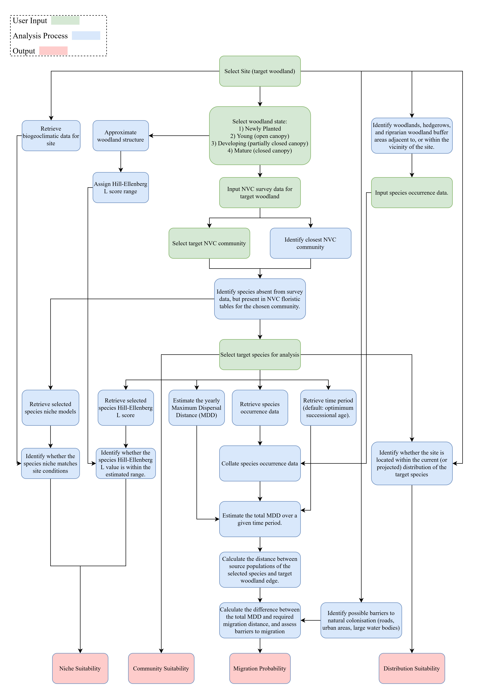
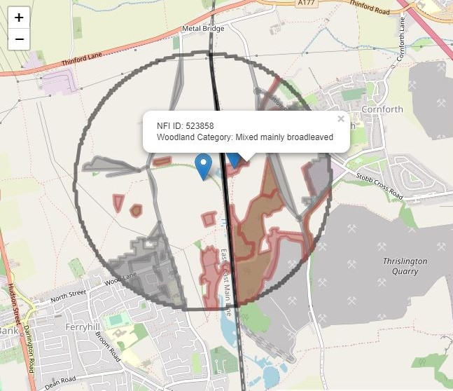

```{r setup, include=FALSE}
knitr::opts_chunk$set(echo = TRUE)

# Load required packages
library(kableExtra)

# Identifies file paths

# Loads required data
source("collateAvailableSpp.R")


```

# Introduction

The United Kingdom (UK) government has set an ambitious target of increasing
tree planting rates from 13850 hectares (ha) per year [@maxwell2022] to 30000 ha 
per year by 2025 [@nao2022].
In in the 2021/2022 planting season 6970 ha of broadleaved
woodland were created in the UK.
However, at present the majority of tree-planting in the UK occurs on former 
agricultural land, which generally results in the development of species-poor 
understory flora communities after establishment [@worrell2021]. 
This represents a significant conservation gap, 
as woodland understory flora represents the majority of 
vascular plant diversity in temperate forest ecosystems and is critical to 
ecosystem functioning.

These outcomes are a consequence of numerous spatio-temporal barriers 
which inhibit the migration of woodland flora, particularly dispersal-limited,
niche-restricted Ancient Woodland Indicator (AWI) plant species.
The aggregate effect of these barriers on flora migration to new woodlands and 
subsequent effect on species composition is an example of 'colonisation credit'
[@watts2020].
In attempts to reduce colonization credit in newly planted woodlands,
woodland creation schemes often aim to establish new woodlands adjacent to 
ancient semi-natural woodland (ASNW), with the view to reducing migration
distance and barriers. This practice has been shown to reduce, but not 
eliminate colonisation credit relative to isolated newly planted woodlands
[@hughes2023]. 

As such, the creation of diverse woodland understory communities cannot be 
relied upon to occur through self-assembly within the time frames stipulated in 
the Kunming-Montreal Global Biodiversity Framework [@unep2022]. 
Specifically, target 4 states the need to:

>*"Ensure urgent management actions to halt human induced extinction of known 
>threatened species and for the recovery and conservation of species, 
>in particular threatened species, to significantly reduce extinction risk, 
>as well as to maintain and restore the genetic diversity within and between 
>populations of native, wild and domesticated species to maintain their adaptive 
>potential, including through in situ and ex situ conservation and sustainable 
>management practices......"*

As part of achieving such ecosystem restoration targets,
a proactive approach must be taken to assist in the colonisation of woodland
flora to newly planted woodlands though translocation,
accelerating the creation of ancient woodland characteristics [@smith2017].

This approach is an increasingly recognised management need.
Organisations such as the Woodland Trust make the need to *"Establish Richer
Communities"* explicit in their 2022 Woodland Creation Guide [@herbert2022].
Practically, organisations such as Eadha Enterprises now operate
woodland understory flora nurseries [@eadhaNursery] and offer ecological
site survey services for understory species translocation suitability
[@eadhaServices]. Centralised guidance has also recently been developed
in the form of the NatureScot Research Report *Establishing woodland
plants in broadleaved woods - interim best practice guidance for
conservation translocations* [@worrell2021]. 
Problematically, despite such advances the infrastructure and guidance to 
facilitate woodland flora translocation at scale is in its infancy.

\newpage

# Aims

In response to the growing need for management advice on woodland flora
translocation the development of an R Shiny [@rcoreteam2022; @chang2022] 
web application is proposed - the Woodland Flora Translocation Tool (WFTTool). 
This application will act as a Decision Support System (DSS),
aiding users in examining the suitability of woodland understory
flora for translocation to a target woodland site.
The application will synthesise the analysis results with additional user inputs
to generate a report using a pro-forma which be developed based on the 
Scottish code for translocations project form [@naturescot2014].

A two-stage development strategy is proposed:

1.  A functional proof-of-concept tool.
    -   Using the current best available data.
    -   Developed as part of a scoping exercise by the author.
    -   No specific project funding.
2.  A comprehensive tool.
    -   Using data derived from additional analysis.
    -   Developed with a project team.
    -   Specific project funding (to be obtained).

The methodologies outlined in the Analysis Process section below correspond to 
development stage 1, with the additional analyses proposed for development stage
2 described in section A3 - Stage 2 Development.
It is hoped that the development stage 1 application will be opened to 
user-testing, with the view to collating feedback to inform development 
priorities for stage 2.

# Analysis Process

Translocations should be planned and managed carefully to reduce risk of
failure or negative outcomes [@deVitis2022].
The conservation translocation guidance provided by @defra2021 describes how
conservation translocations should be ecologically appropriate and conducted 
with the correct permissions and licences. 
It is proposed that this tool is constructed in accordance with the frameworks
established in the
English [@defra2021], 
Scottish [@naturescot2014], 
and International Union for Conservation of Nature (IUCN) [@iucn2013]
guidance documents.

```{r echo=FALSE, message=FALSE, warning=FALSE, fig.cap="A flow diagram representing the proposed analysis workflow."}

 

```

In the context of woodland flora translocations @worrell2021 recommends that a
four-step process be undertaken to ascertain translocation suitability, namely:
    
1. *"Assess the plant communities present in the woodland."*
2. *"Assess the species present in adjacent woods and habitats that may colonise 
naturally."* 
3. *"Assess which plant species would occur naturally in the woodland."*
4. *"Work out which plant species are missing."*

Following this guidance, we define four key criteria for use in determining
translocation suitability:

1.  Niche Suitability
2.  Community Suitability
3.  Migration Probability
4.  Distribution Suitability

Proposed methods to examine the aforementioned criteria are described below, and
represented in Figure 1.

## Niche Suitability

@worrell2021 recommends that soils conditions are assessed for species 
suitability using Hill-Ellenberg scores [@hill1999] 
or the Forest Research Ecological Site Classification (ESC) tool [@pyatt2001].
To examine whether a selected species is suitable for the sites specific
biogeoclimatic conditions, it is instead proposed that the MultiMOVE plant 
species niche models [@henrys2015paper; @henrys2015model; @smart2019] 
will be utilised in conjunction with baseline (1961-1990) climate data along 
with future climate projections obtained from the CHESS-SCAPE dataset 
[@robinson2022] for the annual average rainfall, minimum January temperature, 
and maximum July temperature.
The Forest Research ESC soil survey data will be used, with the 'Soil Wetness', 
'Substrate Fertility' MultiMOVE niche metrics mapped to the (Soil Nutrient 
Regime) and SMR (Soil Moisture Regime) values. 
<!-- Soil pH data will be obtained from.... -->
Lastly, the effect of woodland structure and light availability will be 
assessed using the Hill-Ellenberg light indicator values [@hill1999].

## Community Suitability

Our understanding of how the composition of traits within a community of
organisms scales to constitute and influence ecosystem functioning
is a developing field [@chacnabella2022]. Lacking the understanding to 
design species compositions which form functioning ecosystems and 
stable communities we are reliant on the use of target communities.

As recommended by @worrell2021, to assess whether the selected species is 
sociologically suited to the community of flora present,
or the desired community at the selected woodland
two options will made available to the user:

1.  Selection of a target National Vegetation Classification (NVC) community.
2.  Assessment of the closest NVC woodland communities already present.

To facilitate option 2, an R implementation of the Modular Analysis of 
Vegetation Information System (MAVIS) will be utilised, requiring the user to 
enter NVC survey data for the target woodland.

The selected species will then be cross-referenced against its presence/absence
in the the closest fitted NVC communities to determine phytosociological 
suitability.

## Migration Probability

To determine the likelihood that the selected species will successfully migrate
from nearby sources (if present) to the target woodland, 
the maximum dispersal distance (MDD) will be
estimated by taking the product of the yearly MDD, and user-selected time period 
(measured in years). 
This distance will then be compared to the distance between
the target woodland and source populations.

Source populations will be determined through the entry of species presence data
for the nearby forest habitat network 
(adjacent woodlands, hedgerows, and riparian woodland buffer areas) as
recommended by @worrell2021. This data will be supplemented by the retrieval of 
species occurrence data from the National Biodiversity Network (NBN) Atlas 
[@nbnatlas2023] application programming interface (API). 

Estimations of the yearly MDD will obtained through a
literature review and estimation using the {dispeRsal} R package
[@tamme2014].

It is proposed that the user will then select the time period over which to 
examine dispersal likelihood, with three options available:

1.  An estimate for the optimum successional age (in years) for the
    selected species, measured from the disturbance/establishment time
    of the target woodland derived from @chytry2021.
2.  The difference between the age of the target woodland, and an ecological
    restoration target age.
3.  A custom, user-stipulated value.

Barriers to migration such as roads, paths, rivers, trainlines, and urban areas
will be assessed as obstacles based on the path of migration and dispersal 
symdrome.
See Figure 2 for a provisional representation of how the migration factors will 
be communicated to the user.

## Distribution Suitability

@worrell2021 recommends that the site location should be checked to ensure that
it is within the native range of the species being assessed for translocation.
To determine whether the target woodland is within the distribution of
the selected species permission is currently being sought from the Botanical 
Society of Britain \& Ireland for use of their distribution data.


# Selected Species

A limited subset of species will be included in stage 1 of the
application. This selection will be determined by the available data,
with species selected if they are: 
1) present in the NVC floristic tables for communities W1 - W18e; 
2) present in the MultiMOVE niche models; and
3) used as Ancient Woodland Indicators, as determined by @glaves2009survey. 
The application of these criteria results in the selection
of `r combined_df_selected_speciesCount` species. 
Only `r combined_df_selected_dispeRsalCount` of these species are represented in
the baseline {dispeRsal} data, necessitating estimation of the MDD by traits at 
the genus or family level, or manually through a literature review if
possible. See [Section A2 - Selected Species](#selected_species_table) for the
list of proposed species, which will be subject to change based on further review.


```{r echo=FALSE, message=FALSE, warning=FALSE, fig.align='center', out.width="75%", fig.cap="A screenshot of the interactive map interface taken from the prototype application."}

 

```


\newpage

# Appendix

## A1 - Project Personal

It is proposed that an advisory committee be established to guide stage 1 of the
applications development. It is proposed that funding is allocated to cover the 
time of all project personal for stage 2.

Current participants include:

-   Zeke Marshall, Forest Research - Lead developer.
-   Simon Smart, UK Centre for Ecology & Hydrology (UKCEH) - Advisor
-   Paul Smith, University of Bristol - Advisor

## A2 - Selected Species {#selected_species_table}

```{r proposed_species_table, echo=FALSE, message=FALSE, warning=FALSE, results='asis'}

kableExtra::kbl(x = combined_df_selected, format = "latex", booktabs = TRUE,
                longtable = TRUE,
                caption = "The species selected for stage 1 of the WFTTool.")  %>%
  kableExtra::kable_styling(latex_options = c("scale_down", "repeat_header", "HOLD_position"))

```

## A3 - Stage 2 Development

### A3i - Niche Suitability

There are a number of potential developments for the niche suitability analysis.
Firstly, species absent in MultiMOVE but present in the NVC floristic tables
could be examined.
Secondly, using Forest Research soil survey data and derived datasets for 
SMR and SNR, the MultiMOVE niche models could be expanded to assess the 
'Soil Wetness' and 'Substrate Fertility' variables independently, rather than as 
a function of the community-weighted mean Hill-Ellenberg values.
Thirdly, a Bayesian approach could be taken to integrate species occurrence
and more comprehensive presence-absence survey data following @morera-pujol2022,
additionally further survey data could be added.
Fourthly, the 1km resolution climatic data used to identify the site conditions 
could be down-scaled using the {microclimc} R package [@maclean2021], to
account for the influence of woodland structure on microclimate.

### A3ii - Community Suitability

Further development of the community suitability analysis could include
examination of species absent from the NVC floristic tables and/or
inclusion of a community classification system other than the NVC, e.g. the UK 
Habitat Classification System.
  
### A3iii - Migration Probability

It is likely that the largest source of uncertainty in the analysis is the 
examination of the likelihood of migration. There are several avenues which 
could be explored to improve this methodology. 
Firstly, the probability of successful migration could be calculated using a 
probability density function such as the total dispersal kernel [@rogers2019].
Such functions could be estimated using empirical data [@bullock2016] 
where available. This approach is necessary for capturing the uncertainty
inherent in estimating dispersal distance, particularly for zoochory-mediated
dispersal and for correctly representing species
with sequential dispersal syndromes such as *Mercurialis perennis*, the seeds of 
which are first dispersed ballistically as estimated in @tamme2014, but are then
also dispersed by ants [@jefferson2008].

### A3iv - Distribution Suitability

Further development of the distribution suitability analysis could include....

# References
