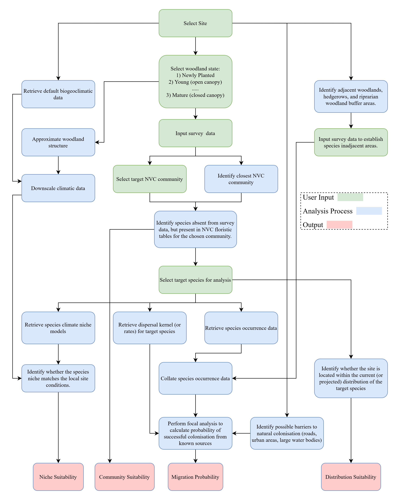

```{r setup, include=FALSE}
knitr::opts_chunk$set(echo = TRUE)

# Load required packages

# Identifies file paths

# Loads required data


```

# Introduction

New woodland creation, planting rates, 

on species poor former arable land


Our understanding of how the composition of traits within a community of
organisms scales to constitute and influence ecosystem functioning
[@chacnabella2022] is a developing field. As argued by @smith2017, a
proactive approach must be taken in ecosystem restoration....

The assisted colonisation of newly planted woodlands is critically needed.
This is particularly important for Ancient Woodland Indicator (AWI) 
species, which are generally observed to have very low dispersal rates,
attributable to traits such as high seed weight [@kimberley2013]
Examples include 
*Anemone nemorosa* which ... ; 
*Hyacinthoides non-scripta* with observed 

# Aims

In response the a R Shiny [@rcoreteam2022, @chang2022] web application will 
developed. This application will act as a Decision Support Tool (DSS), 
aiding users to examine the suitability of a woodland plant translocation
initiative in a standardised framework.

# Adherence to Regulation and Best Guidance

The ...

-   Decide whether a conservation translocation is appropriate
-   Increase the chance of success and wider potential benefits
-   Reduce the chance of failure and negative outcomes


# Colonisation Criteria

Taking inspiration from the restoration diagnostic framework described
in @deVitis2022 the suitability of selected species for assisted
migration are assessed against the following criteria:

-   Colonisation Sources

    -   Are there areas of Ancient Woodland within colonisation
        distance?

    -   Are there areas of other woodland within colonisation distance?

    -   If surveyed, is the selected species present in woodlands within
        colonisation distance?

-   Genetic Factors

-   Biotic Factors

    -   B1 - Does the species require an animal vector for pollination?

-   Abiotic Factors \* Is the selected species suitable for the
    environmental niche on site?

-   Landscape Features

    -   Are there any physical barriers to colonisation?

-   Planning and Land Management Factors

    -   P6 - Is it likely that the selected species will be
        out-competed?

\newpage

# Analysis Process

```{r echo=FALSE, message=FALSE, warning=FALSE}

 

```

\newpage

## Community Suitability

@worrell2021 recommends that a four-step process be undertaken to
examine the necessity of woodland flora translocation, namely the examination 
of: 

1. *Which species are already present in the target woodland?*
2. *Which plant species are already present in adjacent woodland and habitats?*
3. *Which species would naturally occur in the wood?*
4. *Which species are missing from the woodland and nearby linked habitats?*

Following this guidance...

To assess which species would

## Niche Suitability

To examine whether a selected species is suitable for the sites specific
biogeoclimatic conditions, the MultiMOVE plan species niche models 
[@henrys2015paper;@henrys2015model;@smart2019] will be utilised in conjunction 
with baseline (1961-1990) climate data derived from ...; 
along with future climate projections obtained from the CHESS-SCAPE dataset 
[@robinson2022]. These 1km resolution datasets will be down-scaled using the 
{microclimc} R package [@maclean2021]. 

Soils data will be obtained from ... 

Elevation, slope, and aspect data will be obtained from ...

To account for the influence of woodland stage development on site
conditions, and niche suitability the user will be able to stipulate a
proportion of canopy cover....

## Migration Probability

To determine the probability that a species will successfully migrate from a 
nearby source (if present), two methods are proposed:

**Method A**

1. Estimate the maximum yearly dispersal distance, with upper and lower bounds
for selected species.
2. Identify barriers to migration (roads, urban areas, large water bodies etc)
3. Perform a 

**Method B**

1. Parametrise a dispersal kernel for selected species.
2. Identify barriers to migration (roads, urban areas, large water bodies etc)
3. Perform a focal analysis.


## Distribution Suitability

To determine whether the site is within the distribution of the selected species
.....

# Analysis Results

## Species Suitability

It is proposed that the selected species will be recommended for translocation
(or conservatively further investigation) if it is:

1.  Absent from the site.
2.  Present in the target community.
3.  Suitable to the sites local biogeoclimatic conditions, at a given
    stage of woodland development.
4.  Estimated to be unlikely to naturally migrate to the site within a
    reasonable time frame.
5. Within the known distribution of the species.

## Ecological Impact

Following the suggestion in @smith2017, the ecological impact of
translocating a species must be considered, as such the user will also
be presented with an interactive network diagram displaying the
ecological network of the species under assessment.

# Appendix

## Project Personal

## Proposed Species

# References


